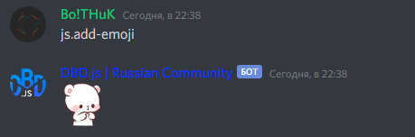

# $addEmoji

Эта функция добавляет эмоции по ссылке.


Ссылка должна быть не больше 256кб в размере.


#### Функции

Эта функция имеет ещё 3 функции. Две обязательных, одна необязательная.  
Описание ниже:

1. URL \(Обязательно\)
2. Name \(Обязательно\)
3. returnEmoji \(Необязательно\)

Пример использования: `$addEmoji[url;name;returnEmoji]`

#### Опции

* URL - Ссылка на изображение\гиф из которой будет сделана эмоция
* Name - Название эмоции
* returnEmoji \(yes/no\) - Возвращает эмодзи, который был недавно создан

Пример использования должен быть следующим:

#### Использование

```javascript
bot.command({
    name: "add-emoji",
    code: `$addEmoji[https://cdn.discordapp.com/emojis/786763619438166036.png;shy_bear;yes]`
});
```

#### Результат:




Ссылка должная кончаться на`.gif`, `.png` или `.jpg`


