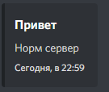
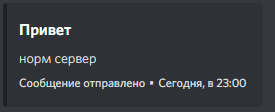
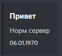

# $addTimestamp

Эта функция добавит метку времени в нижний колонтитул. Отметка времени - это когда сообщение было отправлено или ms!

#### Fields <a id="fields"></a>

Эта функция имеет 1 функцию

1. ms \(обязательно\)

Пример использования: `$addTimestamp[ms (optional)]`

#### Options <a id="options"></a>

* ms - Отметка времени в ms

#### Использование <a id="usage"></a>

```text
bot.command({
name: "timestamp"
code: `
$title[Привет]
$description[Норм сервер]
$addTimestamp
`
})
```



Вы можете написать что либо в футер

```text
bot.command({
name: "timestamp"
code: `
$title[Привет]
$description[норм сервер]
$footer[Сообщение отправлено]
$addTimestamp
`
})
```



Привет! Знаете ли вы, если сообщение с `$addTimestamp` был отправлен в предыдущую дату, он вернет:


​Дата отправки!

```text
bot.command({
name: "timestamp"
code: `
$title[Привет]
$description[Норм сервер]
$addTimestamp[453465654]
`
})
```



