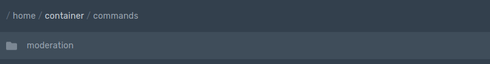

# Обработчик команд

## Ваш основной файл server.js

Основной файл позволит запустить бота, а команды, которые будут сохранены, могут быть названы server.js, index.js все что захочешь

```text
const dbd = require("dbd.js")
 
const bot = new dbd.Bot({
 sharding: false, // true - есть шарды. false - нет шардов 
  shardAmount: 2, // Кол-во шардов 
  mobile: false, // true - Включить активность с телефона. false - Активность с ПК
  token: "TOKEN", // Токен бота
  prefix: ["PREFIX"] // Измените PREFIX на нужный
})
 
bot.onMessage() // Нужно что бы команды выполнялись
bot.loadCommands(`./commands/`) // Нужно что бы команды выполнялись из папки с командами
bot.command({
name: "ping", 
code: `Pong! \`$ping\`` 
})
```

## Настройки файлов Обработчиков команд


Создайте папку с именем "commands"




Создайте подпапку




## И вставьте ваш код

```text
module.exports = {
      name: "name",
      code: `your code/message`
}
```

